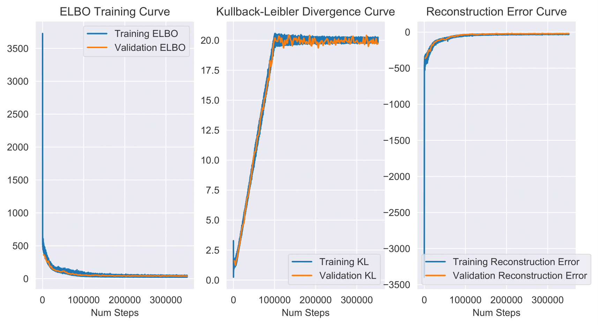

# Beta-VAE 
Original paper: https://openreview.net/pdf?id=Sy2fzU9gl  
Implementation includes improvements from: https://arxiv.org/abs/1804.03599

<b>Note:</b> Models were trained on random subset of 150,000 images from the dsprites data set due to lack of compute power close to NeurIPS deadline 2020.

Performance was evaluated on DCI metric.  
Black and white dsprites data was used.

### DCI Metric performance

 <b>Color:</b> Since we are using black-white no latent variable is responsible 
<b>Shape:</b> μ_10  
<b>Scale:</b> Unclear, looks to be combination of μ_4, μ_6, μ_8   
<b>Orientation:</b> μ_10  
<b>X-axis Position:</b> μ_8  
<b>Y-axis Position:</b>  μ6 

It appears the latent space has not learned that the shape and orientiation as a continuous space. Likely due to the small subset of samples shown. I expect performance to increase as training data set in increased. 

### Reconstructions:

### Latent Traversals:

### Latent_traversal plots:

### Loss curves:

